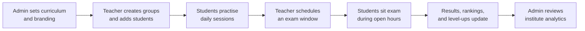

# SEFT Abacus — Product Overview

**Timed mental-math and abacus practice for institutes, teachers, and students.**

> A secure, cloud-based training platform that helps abacus and mental-arithmetic
> institutes run structured practice, fair assessments, and meaningful progress
> tracking — with your own branding on every screen.

---

## At a glance

| | |
| --- | --- |
| **What it is** | A web application (and installable mobile app) for institute-led math practice |
| **Who it serves** | Training institutes, classroom teachers, and students |
| **How students join** | Accounts are created by the institute — there is no public sign-up |
| **What makes it different** | Scores and timers are verified on the server, so results are trustworthy |
| **Branding** | Each institute can use its own name, logo, colours, and tagline |
| **Status** | Production-ready platform; SEFT Institute is the first live tenant |

---

## The problem we solve

Abacus and mental-math institutes need more than worksheets and stopwatches. They need:

- **Structured progression** — students move through levels in a clear order, not ad hoc.
- **Fair timing** — when a session is timed, the clock must be trustworthy.
- **Classroom organisation** — teachers manage groups, assign levels, and see who is improving.
- **Institute control** — one place to manage teachers, students, curriculum, and branding.
- **Motivation** — rankings, streaks, and visible progress keep students engaged.

**SEFT Abacus** brings these together in one platform. Institutes get full operational control; teachers get focused classroom tools; students get a modern practice experience on phone, tablet, or computer.

---

## Who uses the platform

The system is built around four roles. Each person sees only what they need.

```
                    ┌─────────────────────┐
                    │    Platform team    │
                    │   (Super Admin)     │
                    │  Manages institutes │
                    └──────────┬──────────┘
                               │
              ┌────────────────┼────────────────┐
              ▼                ▼                ▼
     ┌─────────────┐   ┌─────────────┐   ┌─────────────┐
     │  Institute  │   │  Institute  │   │  Institute  │
     │      A      │   │      B      │   │      …      │
     └──────┬──────┘   └──────┬──────┘   └─────────────┘
            │                 │
     ┌──────┴──────┐   ┌──────┴──────┐
     │    Admin    │   │    Admin    │  ← Full control of one institute
     └──────┬──────┘   └─────────────┘
            │
     ┌──────┴──────┐
     │   Teachers  │  ← Groups, students, exams, analytics
     └──────┬──────┘
            │
     ┌──────┴──────┐
     │   Students  │  ← Practice, rankings, notifications
     └─────────────┘
```

### Super Admin *(platform operator)*

For the team that runs the overall product across multiple institutes.

- Create and manage institute accounts
- Enable or disable an entire institute
- Create institute administrators and reset their access
- View platform-wide overview and health

### Admin *(institute owner / manager)*

Full control of **one** institute — the person who runs the centre day to day.

- Manage teachers and students (create accounts, reset passwords, enable/disable)
- Design the curriculum: levels, questions, publishing, and imports
- Organise groups and assign teachers
- Configure institute branding (name, logo, tagline, primary colour)
- View institute-wide analytics and activity
- Control what individual teachers and students are allowed to do (permissions)

### Teacher *(classroom lead)*

Focused tools for running classes — without touching institute-wide settings.

- Create and manage **their** student groups
- Add students, assign them to groups and practice levels
- Schedule timed **exams** for a group within a defined window
- Override which questions are active for a group when needed
- View group analytics, rankings, and student progress
- See an activity log of important classroom events

### Student *(learner)*

A clear, motivating practice experience.

- **Standard practice** — timed sessions at their current level; passing can unlock the next level
- **Review mode** — untimed drill for revision without affecting level progression
- **Challenge mode** — harder timed practice for students who want an extra push
- **Scheduled exams** — sit institute- or teacher-set exams during an open window
- Personal progress charts, streaks, and badges
- Group and institute **rankings** (by level and time period)
- In-app notifications and optional **mobile push alerts** (exam reminders, level-ups, etc.)
- Install the app on a phone home screen (Progressive Web App)

---

## How a typical week looks



1. **Admin** publishes levels and questions, and keeps the institute profile up to date.
2. **Teacher** places students in groups and sets each student’s current level.
3. **Students** practise throughout the week — short sessions on any device.
4. **Teacher** schedules an exam; students receive a notification when the window opens.
5. **System** grades attempts, updates rankings, and levels up students who pass.
6. **Admin** reviews dashboards to see institute-wide trends.

---

## Core capabilities

### Curriculum and practice

| Capability | Benefit |
| --- | --- |
| **Level-based curriculum** | Addition through division (and beyond), organised into numbered levels with prerequisites |
| **Question bank** | Institutes build and publish their own question sets; import supported |
| **Curriculum versions** | Publish a new generation of content without losing history |
| **Three practice modes** | Standard (progression), Review (revision), Challenge (stretch) |
| **Server-verified scoring** | Every timer and grade is checked on the server — not on the student’s device |
| **Level-up rules** | Passing criteria and prerequisites are enforced consistently for every student |

### Classroom and exams

| Capability | Benefit |
| --- | --- |
| **Groups** | Teachers organise classes; each group has its own students and settings |
| **Scheduled exams** | Fixed exam papers, defined start/end window, fair one-attempt policy where configured |
| **Exam notifications** | Students are alerted when an exam opens or is about to close |
| **Group question overrides** | Teachers can tailor the active question set for a specific group |

### Progress, motivation, and insight

| Capability | Benefit |
| --- | --- |
| **Personal dashboards** | Students see accuracy, activity, and level progress over time |
| **Rankings** | Leaderboards within a group; broader institute views; optional global comparison |
| **Streaks and badges** | Light gamification to encourage regular practice |
| **Teacher analytics** | Per-group charts: progress, comparison, question performance |
| **Admin analytics** | Institute-wide view of activity and outcomes |
| **Activity logs** | Auditable trail of important actions (publishing, exams, permissions, etc.) |

### Institute identity (white-label)

Each institute can present the platform as **their own product**:

- Institute **name** and **tagline** in the interface
- Custom **logo** and **primary colour**
- Browser tab titles show the institute name after sign-in

Students and teachers experience the centre’s brand, not a generic third-party shell.

### Notifications

| Channel | What it covers |
| --- | --- |
| **In-app inbox** | Exams, level-ups, curriculum changes, permission updates, and more |
| **Browser push** *(optional)* | High-priority alerts when the app is not open — student opt-in from Account settings |
| **Configurable preferences** | Users can mute categories they do not need |

### Mobile-ready (Progressive Web App)

Students can **install SEFT Abacus on their phone** like a native app:

- Home-screen icon and full-screen launch
- Faster repeat visits through smart caching
- Clear offline message when there is no internet (practice always requires a connection)
- Automatic update prompt when a new version is deployed

*Practice and exams always require an internet connection — this keeps scoring fair and secure.*

### Access control and safety

| Principle | What it means in practice |
| --- | --- |
| **No public registration** | Only admins and teachers create accounts — the institute controls who gets in |
| **Role-based access** | Each role sees only the screens and actions relevant to their job |
| **Per-user permissions** | Admins can fine-tune what an individual teacher or student may do |
| **Data isolation** | Each institute’s data is separated; one centre cannot see another’s students |
| **Account lifecycle** | Admins can disable users; the platform can disable an entire institute if needed |
| **Password reset** | Secure forgot-password flow for users who lose access |

---

## Why institutes can trust the results

Traditional apps run the timer in the browser. A student could pause, refresh, or manipulate the clock.

**SEFT Abacus does not work that way.**

- The **server** starts the session, sets the deadline, and stores the correct answers.
- When a student submits, the **server** grades every answer and decides pass/fail and level-up.
- The student’s device only displays questions and collects answers — it never decides the score.

This is essential for fair rankings, credible exams, and parent confidence.

---

## What students experience

A typical student journey:

1. **Sign in** with the email and password provided by their teacher or admin.
2. Open **Practice** and choose Standard, Review, or Challenge.
3. Complete a timed set of mental-math questions.
4. See immediate results — accuracy, pass/fail, and whether they levelled up.
5. Check **Ranking** to see how they compare within their group.
6. Receive a notification when a **scheduled exam** opens.
7. Optionally **install the app** on their phone for quicker access.

The interface is designed for clarity on mobile: large tap targets, readable results, and simple navigation.

---

## What teachers experience

Teachers spend less time on admin and more time teaching:

- One dashboard for all their groups
- Quick student lookup and level assignment
- Schedule an exam in a few steps; the system handles the window and notifications
- Charts that show who is improving and who needs support
- No access to institute-wide settings they should not touch

---

## What institute admins experience

Admins run the centre from a single control panel:

- Onboarding checklist for new institutes
- Full user management (teachers, students)
- Curriculum builder with levels, questions, and publishing workflow
- Export student progress reports
- Branding settings and institute profile
- Permission controls for staff and students
- Activity and analytics across the whole institute

---

## Platform scale: built for more than one institute

Although SEFT Institute is the first live client, the product is architected as a **multi-institute platform** from day one:

- A **Super Admin** layer can onboard additional centres without a separate codebase.
- Each new institute gets isolated data, its own admin, and starter curriculum levels.
- The same product can power multiple brands under one operational team.

This protects your investment: growth does not require rebuilding the system.

---

## Legal and compliance

Public pages are in place for transparency:

- **Privacy Policy** — how user and institute data is handled
- **Terms of Service** — rules of use for institutes and end users

Institutes should review these with their own legal counsel before a public launch.

---

## Current delivery status

| Area | Status |
| --- | --- |
| Multi-role platform (Super Admin, Admin, Teacher, Student) | ✅ Live |
| Curriculum, practice modes, level-up | ✅ Live |
| Scheduled exams and notifications | ✅ Live |
| Rankings, analytics, gamification | ✅ Live |
| White-label branding per institute | ✅ Live |
| Progressive Web App (install on mobile) | ✅ Live |
| Web push notifications | ✅ Live (optional; requires server configuration) |
| Email verification | Planned follow-up |
| Billing / subscriptions | Future commercial phase |
| Custom domain per institute (e.g. `learn.yourbrand.com`) | Future phase |

---

## Getting started (for your institute)

1. **Platform team** provisions your institute and creates the first **Admin** account.
2. **Admin** signs in, completes the onboarding checklist, and sets branding.
3. **Admin** creates **Teacher** accounts (or teachers are pre-seeded).
4. **Teachers** create groups and add **Students**.
5. **Students** sign in and begin practice.

Accounts are never self-service — your institute always controls membership.

---

## Summary

**SEFT Abacus** is a complete digital practice platform for abacus and mental-arithmetic institutes. It combines structured curriculum, fair server-verified assessment, classroom management, motivating rankings, and your own branding — accessible on desktop and mobile.

It is built to grow from a single centre to a multi-institute operation without changing the product foundation.

---

*Document version: July 2026 · For client presentation and onboarding.*  
*Technical deployment and operator guides are available separately for your development team.*
